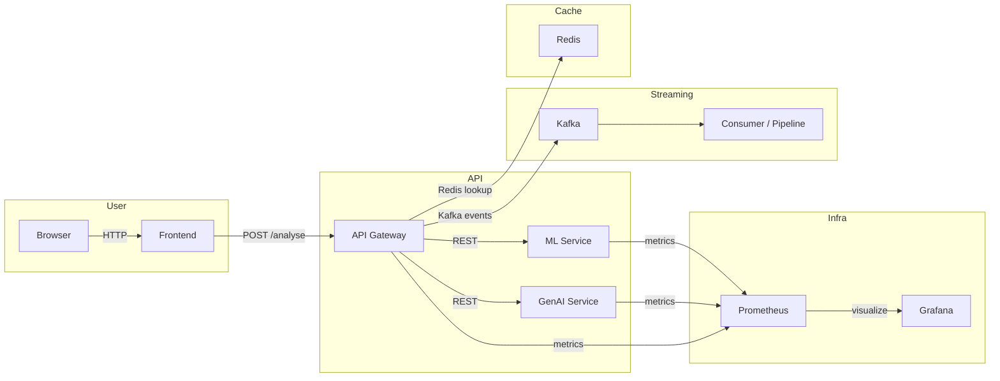

# Architecture Overview

## System components
- `frontend`: React/Vite UI serving user input and queries.
- `api-gateway`: FastAPI gateway and routing layer.
- `ml-service`: model scoring service for severity estimation.
- `genai-service`: RAG/LLM enrichment and explanation service.
- `kafka`: streaming backbone for data and event pipelines.
- `redis`: caching and fast lookup.
- `prometheus`: metrics scraping.
- `grafana`: dashboard visualization.

## Service flow

## Notes
- Grafana provisioning should auto-configure Prometheus as the data source and import dashboards from `observability/grafana/dashboards`.
- Loki is a recommended addition for log aggregation, but it is not wired into this repo yet.
- If you want a next step, add a Loki + Promtail service, then instrument FastAPI app logs/containers.
